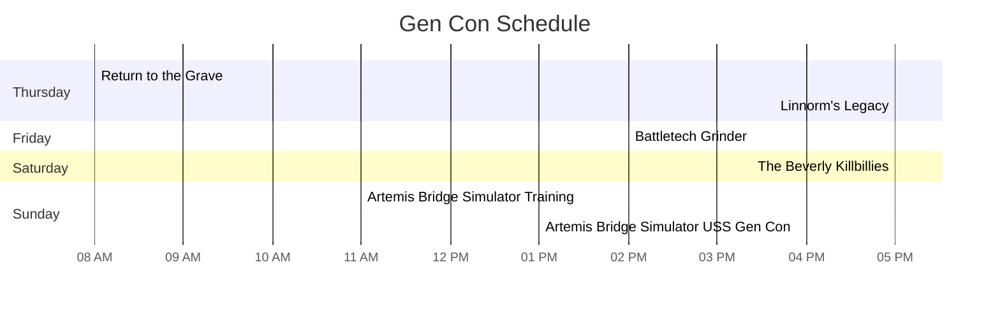

# Gen Con Event Plan

## Game Systems
- BattleTech
- Pathfinder
- Hero System

## Planned Events
- [Battletech Grinder](https://www.gencon.com/event_finder?search=%22Battletech+Grinder%22&c=indy2022)
    - Time to be determined
- [PFS(2ED) #4-02: RETURN TO THE GRAVE](https://www.gencon.com/events/206964)
    - Thursday 8am 5 hours
- [PFS(2ED) #4-03: LINNORM'S LEGACY](https://www.gencon.com/events/206980)
    - Thursday 2pm 5 hours
- [THE BEVERLY KILLBILLIES: JOURNEY TO THE CENTER OF THE APPALACHIANS](https://www.gencon.com/events/205032)
    - Saturday 5pm 4 hours 

## Alternative Options
- [Artemis Bridge Simulator](https://www.gencon.com/event_finder?game=Artemis+Bridge+Simulator)
- [Starship Horizons](https://www.gencon.com/event_finder?game=Starship+Horizons)
- [LATE SHOW FEATURE: GATORSHARK VS. ZOMBIE CHEERLEADERS](https://www.gencon.com/events/202347)
- [Secret Hitler](https://www.gencon.com/event_finder?game=Secret+Hitler)